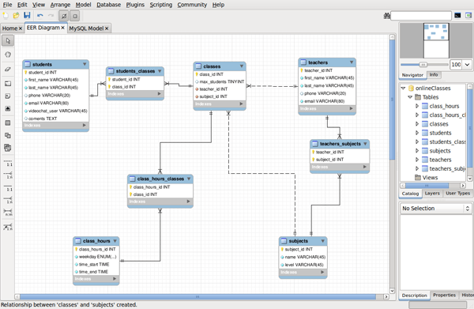
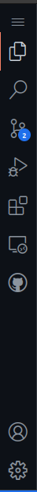
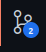
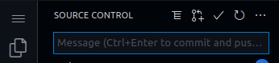
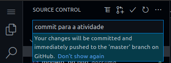
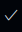

[RETORNAR](../README.md)

# Atividade CREATE TABLE

 

Crie uma pasta no repositório, com o nome de atividade_06_julho_2022
Dentro desta pasta, crie o arquivo com o nome de atividade.sql
Já no arquivo atividade.sql, coloque os scripts para se criar as tabelas referentes ao diagrama.

Ao terminar lembre de efetuar o commit para salvar.

## Para salvar:

* **No menu lateral**

* **Clique sobre o item** 

* **Insira o commit na caixa de dialogo** 
    
    
    
    - **O seu commit sera com o seguinte texto, *atividade 06/07/2022***

* **Logo em seguida, clique no simbolo de cheque para efetuar o commit** 