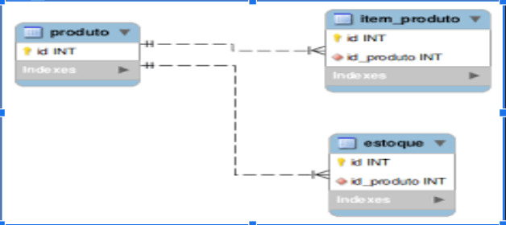
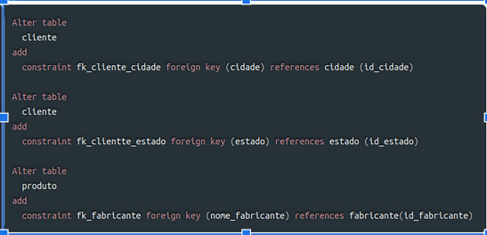
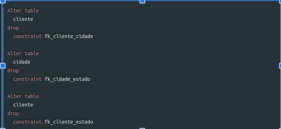

# Adicionar chave estrangeira

Chave estrangeira (foreign key) é o campo que estabelece o relacionamento entre duas tabelas. Assim, uma coluna corresponde à mesma coluna que é a chave primária de outra tabela. 

Dessa forma, deve-se especificar na tabela que contém a chave estrangeira quais são essas colunas e à qual tabela está relacionada. O banco de dados irá verificar se todos os campos que fazem referências à tabela estão especificados.
Determinar esse tipo de relacionamento, fica garantida a integridade das informações. Os valores presentes nas colunas definidas como chave estrangeira devem ter um correspondente em outra tabela, caso contrário o banco de dados deve retornar uma mensagem de erro, assim as restrições de chave estrangeira identificam os relacionamentos entre tabelas e assegura que a integridade referencial seja mantida.
Constraints são regras agregadas a colunas ou tabelas. Assim, pode-se definir como obrigatório o preenchimento de uma coluna que tenha um valor-padrão quando uma linha for incluída na tabela ou quando aceitar apenas alguns valores pré-definidos. No caso de regras aplicadas a tabelas, tem-se a definição de chaves primárias e estrangeiras.

## Agora, após criadas as tabelas, podemos ALTER e adicionar uma Foreign Key (o relacionamento)

Mais uma vez, uma chave estrangeira é muito importante. É ela que vai fazer referência (relacionamento com outra). Antes de tudo, analise a estrutura da tabela, não poderá excluir uma chave estrangeira se o campo da tabela referenciada estiver preenchido.

